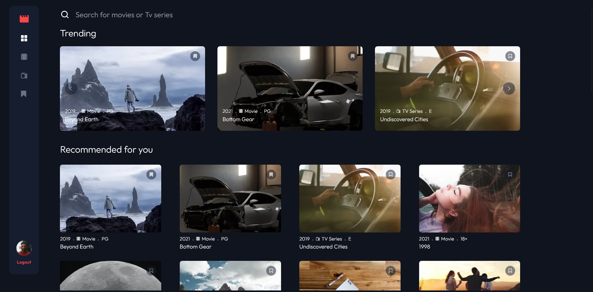

# Frontend Mentor - Entertainment-web-app solution

This is a solution to the [Entertainment-web-app- on Frontend Mentor](https://www.frontendmentor.io/challenges/entertainment-web-app-J-UhgAW1X). Frontend Mentor challenges help you improve your coding skills by building realistic projects.

## Table of contents

- [Overview](#overview)
  - [The challenge](#the-challenge)
  - [Screenshot](#screenshot)
  - [Link](#link)
- [My process](#my-process)
  - [Try](#try)
  - [Built with](#built-with)
  - [Versions](#versions)
  - [What I learned](#what-i-learned)
  - [Continued development](#continued-development)
- [Author](#author)

## Overview

### The challenge

Users should be able to:

- Navigate between Home, Movies, TV Series, and Bookmarked Shows pages
- Add/Remove bookmarks from all movies and TV series
- Search for relevant shows on all pages
- View the optimal layout for the app depending on their device's screen size
- See hover states for all interactive elements on the page
- Build this project as a full-stack application
- If you're building a full-stack app, we provide authentication screen (sign-up/login) designs if you'd like to create an auth flow

### Screenshot



### Links

- Solution URL: [frontend Mentor solution](https://www.frontendmentor.io/solutions/)
- Live Site URL: [Live site](https://entertainment-web-app-five.vercel.app/)

## My process

### Try

You can login with the user "test" or signup :

```bash
email : test@test.com
```

```bash
password : 0000
```

### Built with

- Tailwind Css
- Next.js
- Typescript
- Zustand store

### Version

- node.js : 20.11.0
- "bcrypt": "^5.1.1",
- "cookies": "^0.9.1",
- "dotenv": "^16.4.5",
- "jose": "^5.6.3",
- "js-cookie": "^3.0.5",
- "mongodb": "^6.8.0",
- "next": "^14.2.4",
- "react": "^18.3.1",
- "react-dom": "^18.3.1",
- "react-responsive": "^10.0.0",
- "zustand": "^4.5.4"
- tailwindcss": "^3.4.4",
- typescript": "^5"

### What I learned

- learn to use next.js
- learn typescript
- learn the authentification with https only
- learn about Zustand store
- learn backend with Next.js api route and MongoDp
- learn Tailwind Css

### Continued development

- Practice backend with MongoDb
- next time use library for Auth
- Practice typescript

## Author

- Github- [Github](https://github.com/Stv-devl)
- Frontend Mentor - [@Stv-devl](https://www.frontendmentor.io/profile/Stv-devl)
